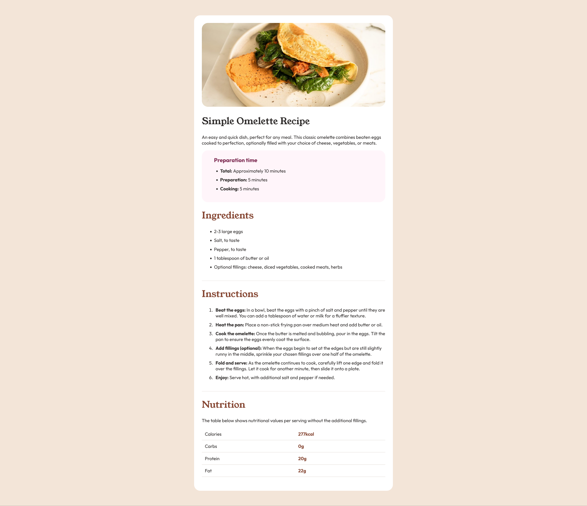

# Frontend Mentor - Recipe page solution

This is a solution to the [Recipe page challenge on Frontend Mentor](https://www.frontendmentor.io/challenges/recipe-page-KiTsR8QQKm). Frontend Mentor challenges help you improve your coding skills by building realistic projects. 

## Table of contents

- [Overview](#overview)
  - [The challenge](#the-challenge)
  - [Screenshot](#screenshot)
  - [Links](#links)
- [My process](#my-process)
  - [Built with](#built-with)
  - [What I learned](#what-i-learned)
- [Author](#author)

## Overview

### Screenshot

### Links

- Solution URL: [solution URL here](https://github.com/yvonnem111/recipe-page-main/blob/main/index.html)
- Live Site URL: [live site URL here](https://htmlpreview.github.io/?https://github.com/yvonnem111/recipe-page-main/blob/main/index.html)

## My process

### Built with

- Semantic HTML5 markup
- CSS custom properties
- Flexbox

### What I learned

This was pretty straight-forward.

## Author

- Name - [Yvonne Joseph](https://www.yvonnejoseph.com)
- Frontend Mentor - [@yvonnem111](https://www.frontendmentor.io/profile/yvonnem111)

